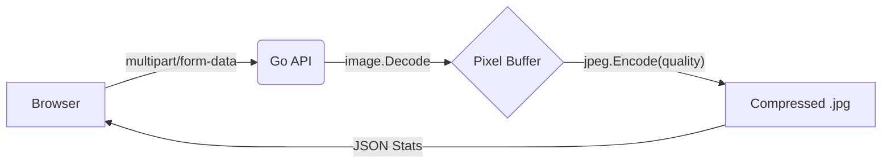

# Squeeze.sh 🖼️⚡

### High-Performance Image Compression Engine

Squeeze is a minimalist, industrial-grade image optimization tool. It takes your heavy assets and "squeezes" them into production-ready JPEGs using Go's high-efficiency standard library.

---

## 🚀 Quick Start

### 1. Fire up the Backend (Go)

```bash
cd backend
go run main.go
```

_Running on `http://localhost:8080`_

### 2. Launch the Frontend (Astro + React)

```bash
cd frontend
npm install
npm run dev
```

_Active at `http://localhost:4321`_

---

## 🛠️ The Stack

| Layer            | Technology           | Role                                        |
| :--------------- | :------------------- | :------------------------------------------ |
| **Frontend**     | Astro                | Lightning fast SSR foundation               |
| **Logic**        | React                | State management for the compression engine |
| **UI**           | Hero UI + Tailwind 4 | Linear-inspired minimalist design           |
| **Backend**      | Google Go            | Raw pixel processing & API                  |
| **Standard Lib** | `image/jpeg`         | Byte-level image re-encoding                |

## 🧠 Developer's Deep Dive: Why Go?

Most image tools rely on heavy C-libraries like `libvips` or `ImageMagick`. Squeeze is different. It uses Go's **Standard Library (`image`)**.

### The Pixel Pipeline:

1.  **Decode**: The engine uses `image.Decode` to convert your `multipart/form-data` stream into a pixel bit-map in memory.
2.  **Buffer**: It registers formats (`jpeg`/`png`) via `init()` magic to handle various headers.
3.  **Re-encode**: It passes the raw pixel buffer to `jpeg.Encode`. This is where the magic happens—by adjusting the `quality` parameter (1-100), we tell Go how much data to "discard" in the DCT (Discrete Cosine Transform) phase.
4.  **JSON Stats**: We compare the `os.FileInfo` size before and after to calculate your savings.

---

## ⚙️ Configuration (.env)

The backend looks for a `.env` file for production safety:

## 📐 Architecture



Built for engineers who love clean code.
